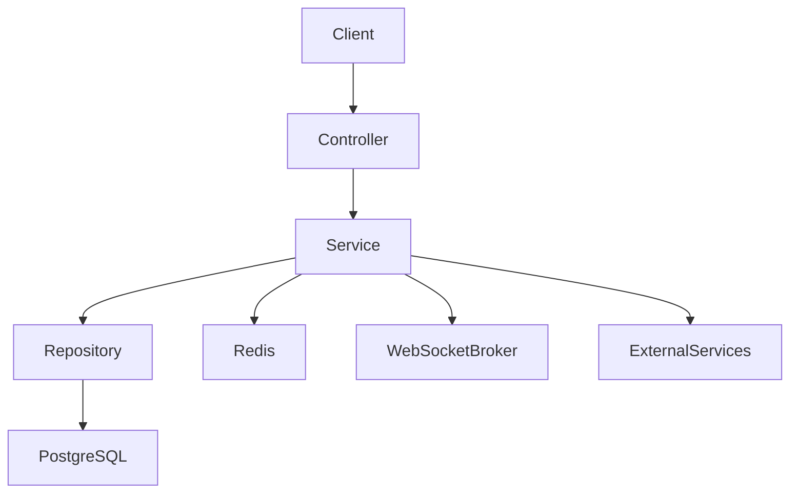

# 🚀 Donate Backend

> Backend service for a streamer donation platform with authentication, wallet, realtime notifications, and payment processing.


---

# 📖 Overview

`donate-backend` is the backend API for a donation platform that connects viewers and streamers. The system supports account authentication, streamer profile management, donation flows via wallet or QR payment, transaction history, realtime updates through WebSocket, notification delivery, report handling, and admin management features.

This project is built with Spring Boot and follows a layered architecture around controller, service, repository, and entity modules.

---

# ✨ Features

- JWT-based authentication and profile lookup
- Google login support
- Role-based authorization for user, streamer, and admin
- Streamer profile, avatar, thumbnail, and bio management
- Donation flows via wallet, bank QR, and payment QR
- Wallet balance, wallet transaction history, and withdrawal requests
- Realtime payment and notification updates with WebSocket
- Follow and unfollow streamers
- Product promotion and streamer statistics management
- Violation reporting and admin moderation
- Caching for selected high-traffic read paths
- File upload integration with Cloudinary
- FPT AI text-to-speech endpoint integration

---

# 🛠 Tech Stack

| Category | Technology |
|-----------|------------|
| Language | Java 17 |
| Framework | Spring Boot 3.3.5 |
| Security | Spring Security, JWT |
| ORM | Spring Data JPA, Hibernate |
| Database | PostgreSQL |
| Cache / Realtime Data | Redis, Caffeine |
| Realtime | WebSocket, STOMP, SockJS |
| File Storage | Cloudinary |
| External Services | Google Token Verification, VietQR, FPT AI TTS |
| Build Tool | Gradle |
| Containerization | Docker |
| Monitoring | Spring Boot Actuator |
| Version Control | Git |

---

# 🏗 Architecture



---

# 📂 Project Structure

```text
src/main/java/org/example/donatebackend
├── config
├── controller
│   └── admin
├── dto
│   ├── request
│   └── response
├── entity
├── enums
├── exception
├── mapper
├── redis
├── repository
├── service
│   └── upload
└── util

src/main/resources
└── application.properties
```

---

# 🗄 Database Design

The application uses PostgreSQL as the primary database and persists data for:

- users and authentication data
- streamer profiles and settings
- donations and payment records
- wallets, wallet transactions, and withdrawals
- notifications
- followers and blocked users
- product promotions
- reports and penalties

If an ERD is added later, place it in:

```text
docs/database.png
```

---

# ⚡ Performance Optimizations

### Database

- PostgreSQL is configured as the primary relational database.
- HikariCP connection pooling is enabled.
- Pagination is used on management and listing flows where applicable.
- The codebase already includes performance test scripts for donate and websocket workloads under `../test/`.

### Backend

- Service and DTO layers help keep API contracts separated from persistence models.
- Caffeine caching is enabled for selected frequently accessed resources.
- Global exception handling standardizes API error responses.
- Multipart upload limits are configured to protect the application from oversized requests.

### Realtime

- WebSocket + STOMP is used for payment and notification updates.
- Redis is available for shared state and leaderboard-related flows.

### Security

- Stateless JWT authentication
- Spring Security authorization rules by endpoint and role
- CSRF disabled for API-style stateless usage
- Controlled access for admin-only routes

---

# 🚀 Installation

## Prerequisites

- Java 17
- Gradle or Gradle Wrapper
- PostgreSQL
- Redis

## 1. Clone the repository

```bash
git clone https://github.com/username/donate-web-BE.git
cd donate-web-BE/donate-backend
```

## 2. Configure environment

Update `src/main/resources/application.properties` with your local values before running:

- PostgreSQL connection
- Redis host and port
- JWT secret
- VietQR credentials
- FPT AI TTS key
- Cloudinary credentials

## 3. Start required services

Example Redis container:

```bash
docker run -d --name donate-redis -p 6379:6379 redis:7
```

Make sure PostgreSQL is also running and the configured database already exists.

## 4. Run the application

```bash
gradlew.bat bootRun
```

## 5. Build the project

```bash
gradlew.bat build
```

---

# 📡 API

| Method | Endpoint | Description |
|----------|----------|-------------|
| POST | `/api/auth/register` | Register a new account |
| POST | `/api/auth/login` | Login and receive JWT |
| GET | `/api/auth/me` | Get current authenticated user |
| POST | `/api/auth/google` | Login with Google token |
| GET | `/api/streamers/search` | Search streamers |
| GET | `/api/streamers/{token}` | Get streamer detail |
| POST | `/api/donate/qr` | Create donation via payment QR |
| POST | `/api/donate/bank-qr` | Create donation via bank QR |
| POST | `/api/donate/wallet` | Donate using wallet balance |
| GET | `/api/donate/history` | Get donation history |
| GET | `/api/wallets/me` | Get current wallet |
| GET | `/api/wallet-transactions` | Get wallet transactions |
| POST | `/api/withdrawals` | Create withdrawal request |
| GET | `/api/notifications` | Get notifications |
| POST | `/api/webhooks/sepay` | Receive SePay webhook callback |
| GET | `/api/admin/overview` | Get admin dashboard summary |

---

# 🔌 Realtime

The backend exposes a SockJS WebSocket endpoint:

```text
/ws
```

Clients can subscribe to topics under:

```text
/topic/**
```

This is used for realtime donation and notification flows.

---

# 🧪 Testing And Benchmarking

The repository includes several test and benchmark scripts outside the backend module:

```text
../test/websocket-performance-test.cjs
../test/donate-concurrency-test.cjs
../test/donate-ramp-test.cjs
../test/donate-capacity-test.cjs
../test/k6-donate-load.js
```

These scripts are useful for validating donate throughput, websocket fan-out, and capacity behavior under concurrent load.

---

# 🔮 Future Improvements

- Move sensitive credentials from source config to environment variables or secret management
- Align local Docker Compose setup fully with PostgreSQL-based runtime configuration
- Add OpenAPI / Swagger documentation
- Add Redis-backed distributed websocket scaling if deployed across multiple instances
- Expand automated integration and performance test coverage
- Add CI/CD pipeline for build, test, and deployment

---

# 👨‍💻 Author

**Ngo Van Duc**

Email: ducvan26324@gmail.com

---

# 📄 License

MIT License
